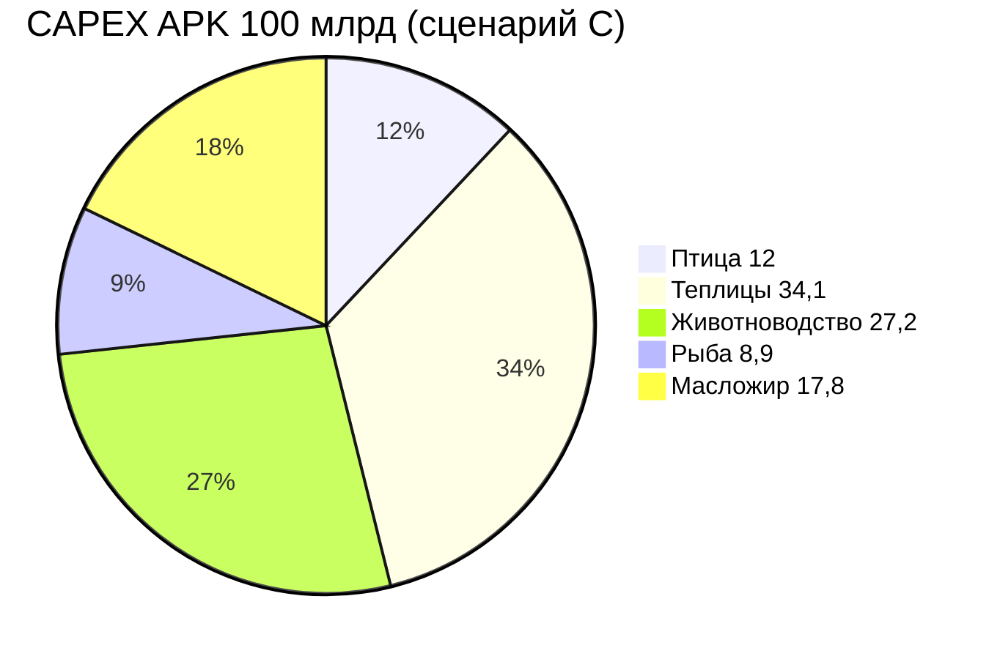

# Встройка 12 млрд птицы в контур APK 100 млрд

> Единый слайд / график для инвестмемо.  
> **Канон: сценарий C — итого ровно 100 000 млн ₽.**  
> Источники: `docs/1.2-слайд Фин модель.xlsx` (Приложение 3Б), `finmodel-pticekompleks-12-mlrd.xlsx` (лист **«APK-100»**), `docs/scenarios/poultry-teo.yaml` → `project.apk_100bln`.

## Контуры (не путать)

| Контур | Земля | CAPEX | Статус |
|--------|-------|-------|--------|
| **Baseline «МОЯ МЕЧТА»** | 100 000 га, Херсонская обл. | **100 млрд ₽** | active TEO (кролики) |
| **Нова-Агро — направление птица** | **250 000 га**, Запорожская обл. | **12 млрд ₽** (блок) | draft |
| **Связка** | Разные регионы; **инвестиционный слот** — замена блока «кролики» в структуре 100 млрд | см. таблицу ниже | |

Земля птицы: **APK 250 000 га** — базовая площадь холдинга в Запорожской области; **слот блока 400 га**; кадастр / схема размещения / разрешения — **позже** (`land-budget.yaml`).

---

## Слайд 1. Структура CAPEX APK (канон — сценарий C)

| № | Блок (Приложение 3Б) | Baseline (кролики), млн ₽ | **С птицей (C), млн ₽** | Δ, млн ₽ |
|---|----------------------|---------------------------|-------------------------|----------|
| 1 | ~~Кролиководческая ферма~~ → **Птицеводческий комплекс «Нова-Агро»** | 11 041,5 | **12 000,0** | **+958,5** |
| 2 | Тепличный комплекс | 34 500,0 | **34 128,3** | **−371,7** |
| 3 | Животноводческая ферма (КРС/МРС) | 27 458,5 | **27 162,6** | **−295,9** |
| 4 | Рыбоводческая ферма (белуга) | 9 000,0 | **8 903,0** | **−97,0** |
| 5 | Масложировой комбинат | 18 000,0 | **17 806,1** | **−193,9** |
| | **ИТОГО APK** | **100 000,0** | **100 000,0** | **0** |

**Логика:** блок птицы **12 000** (полный finmodel); **958,5** снято пропорционально с блоков 2–5 — тот же объём, что **ККЗ FRAGOLA** у кроликов в ФРП, но у птицы ККЗ **вне блока** (корм с завода холдинга). Суммарный конверт APK **не растёт**.

### Альтернативы (не канон)

| Сценарий | Итого | Комментарий |
|----------|-------|-------------|
| A: замена 1:1 без урезания | 100 958,5 | +958,5 к baseline |
| B: птица урезана до 11 041,5 | 100 000 | теряем finmodel CAPEX |
| **C: птица 12 000, trim блоков 2–5** | **100 000** | **утверждено** |

---

## Слайд 2. Источники финансирования 100 млрд (агрегат)

| Источник | Baseline 100 млрд, млн ₽ | Доля | Что меняется при замене на птицу |
|----------|--------------------------|------|----------------------------------|
| **ФНБ** | ~50 052 | ~50% | Слайс блока 1: **600** (5% от 12 000) |
| **РАЛ** | ~50 052* | ~50% каталог | Слайс блока 1: **2 340** (оборудование птицы) |
| **ФРП + банки** | ~47 768 | ~48% | Слайс блока 1: **9 060** (СМР, solar, compost, ОС…) |
| **ИТОГО** | **100 000** | 100% | Блок 1: **12 000** вместо 11 041,5 |

\* В xlsx RAL и FNB секции зеркалят структуру по блокам; детализация блока 1 — лист «Финансирование» finmodel птицы.

### Блок 1 — детализация (12 000 млн ₽)

| Источник | млн ₽ | % блока |
|----------|-------|---------|
| ФНБ | 600 | 5,0% |
| РАЛ | 2 340 | 19,5% |
| ФРП | 0 | — (ККЗ на APK) |
| Банки | 9 060 | 75,5% |
| **Итого** | **12 000** | 100% |

---

## Слайд 3. Общая инфраструктура APK (без изменений)

| Актив | Baseline | Птица |
|-------|----------|-------|
| ККЗ ~300 тыс. т/год | общий | **22%** мощности на корм птицы |
| Биogaz APK **20 МВт·ч** | навоз кроликов + др. | **помёт птицы** → та же установка |
| Solar **50 МВт·ч** (холдинг) | 10+20+20 | **10** на блоке птицы (CAPEX в 12 млрд) |
| Убой / экспорт / УK | общие службы | УПК птицы **в блоке**; экспорт — позже |

---

## Слайд 4. Операционный вклад в APK (полная мощность)

| Показатель | Кролики (baseline) | Птица (finmodel) |
|------------|-------------------|------------------|
| CAPEX блока | 11 041,5 | 12 000 |
| Выручка/год | 4 798 | **5 559** |
| EBITDA/год | — (нет в docx) | **2 216** |
| Рабочих мест | 300 | **476** |
| Мясо, т/год | 7 000 | **18 169** (+ яйцо) |

---

## Файлы

| Артефакт | Путь |
|----------|------|
| Канон сценария C | `docs/scenarios/poultry-teo.yaml` → `project.apk_100bln` |
| Лист «APK-100» | `finmodel-pticekompleks-12-mlrd.xlsx` |
| Финансирование блока | лист «Финансирование» того же xlsx |
| Шаблон 100 млрд | `docs/1.2-слайд Фин модель.xlsx` |
| Земля | `land-budget.yaml` |

Пересчёт блоков C: `python3 scripts/calc-poultry-scenarios.py`
