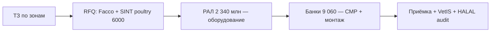

# Оборудование и вендоры — птицеводческий комплекс 12 млрд ₽

> **Статус:** канон draft (июнь 2026). Замена блока кроликов в narrative baseline.  
> **Firm-контрактов нет** — формулировки для master DOCX и RFQ.

## Канонические формулировки (основной текст)

### Содержание и выращивание (вместо Meneghin Srl)

Полностью автоматизированное, инновационное и высокотехнологичное оборудование для содержания и выращивания птицы (**118 птичников/модулей**: бройлер, несушки, индейка, утка, гусь, перепёл) будет поставлено итальянской компанией **Officine Facco & C. S.p.a.** Профиль: туннельная/припольная система, кормление, поение, климат-контроль, SCADA, микроклимат. **80 бройлерных** модулей по **18 000 голов**; **6** блоков клеточного содержания несушек (**480 000** голов).

*Альтернатива (приложение / RFQ):* **Tekno Poultry Equipment** (Италия) — клеточные и aviary-системы для несушек.

### Убой и переработка (SINT — птица, не кролик)

Убойно-перерабатывающий комплекс на производственной площадке. Основная линия бройлера — **6 000 голов/ч** (8 ч = 48 000/сут). Поставщик: **SINT Tecnologie S.r.l.** (Италия) — **модульная установка убоя и переработки птицы** (линия poultry, **не** линия 2 400 гол/ч для кроликов). Халяль-блок без электрооглушения — внутренний рынок РФ. Дополнительно: линии индейки (**500 гол/сут**), утки/гуся (**2 000 гол/сут**). CAPEX УПК: **2 600 млн ₽**.

### Генетика (вместо ANCI)

Генетическая программа комплекса построена на **промышленных кроссах**, доминирующих на рынке РФ:

| Направление | Кросс |
|-------------|-------|
| Бройлер | **ROSS 308** (Aviagen) |
| Куриное яйцо | **Hisex / Lohmann Brown** (Hendrix Genetics) |
| Индейка | **BUT Big 6** |
| Утка | **Cherry Valley SM3** |
| Гусь | **Линдовская** |
| Перепёл | **Фараон** |

Племенной материал (инкубационные яйца, суточный молодняк) поставляется через **авторизованные репродукторы/инкубатории РФ** с ветеринарным сопровождением и учётом в **VetIS**. Контроль продуктивности — по отраслевым нормативам (FCR, яйценоскость, падёж, убойный выход).

### Общая инфраструктура APK (= baseline «МОЯ МЕЧТА»)

| Зона | Поставщик (как в основном ТЭО) | Параметр |
|------|--------------------------------|----------|
| Комбикорм | **F.lli FRAGOLA S.p.a.** (Италия) | ККЗ холдинга **262 800 т/год**; корм птице **~66,7 тыс. т/год** (**вне CAPEX** блока 12 млрд) |
| Compost | **PRIMERANO INNOVATION SRLS** (Италия) | **5 т/ч**, **43 800 т/год** удобрения; CAPEX **36 млн ₽** |
| Solar | **ASTORIOS HOLDING INC** | **10 МВт·ч**; CAPEX **1 180,8 млн ₽** |
| Биогаз APK | итальянская технология (вендор не named) | **20 МВт·ч** — общая установка холдинга; помёт → biogaz |
| Генподряд APK | **ROTA GUIDO Srl** (Италия) | EPC всего проекта (как baseline) |

---

## Сводка по зонам

| Зона | CAPEX (finmodel) | Производительность | Канон-поставщик |
|------|------------------|--------------------|-----------------|
| Птичники бройлера (80×) | часть 2 405 | 18 000 гол/дом | **Facco** (IT) |
| Клетки несушек (6×) | ↑ | 480 000 гол | **Facco** |
| Индюк / утка / гусь / перепёл | 1 025 | см. T02 | **Facco** + модульные линии |
| Инкубаторий | в 8 570 | **500 тыс. яиц/нед.** | **Petersime** (EU, сервис РФ) |
| УПК бройлер | **2 600** | **6 000 гол/ч** (8 ч) | **SINT Tecnologie** (IT), modular poultry |
| Линии индейка / утка | в УПК | 500 / 2 000 гол/день | **SINT** (вторичные линии) |
| Сортировка яйца | в 8 570 | **0,5 млн шт/день** | **Moba Omnia** |
| Холод **4 000 т** | 800 | −18 / +2 °C | **ААБ / Khladotech** (РФ) |
| Solar **10 МВт·ч** | **1 180,8** | — | **ASTORIOS HOLDING INC** |
| Compost **5 т/ч** | **36** | 43 800 т/год | **PRIMERANO INNOVATION SRLS** |
| ККЗ | **вне блока** | 262 800 т/год | **F.lli FRAGOLA S.p.a.** |
| Переработка пера/крови | в УПК | — | **Amandus Kahl** или **Волжский завод** |

---

## Сравнение с baseline кроликов

| | Кролики | Птица (канон) |
|--|---------|---------------|
| Содержание | **Meneghin Srl** (IT), 69 intensive | **Facco** (IT), 118 модулей |
| Убой | **SINT** 2 400 гол/ч (кролик) | **SINT** **6 000 гол/ч** (poultry, modular) |
| Генетика | **ANCI** (IT) | **ROSS 308 / Hisex / …** + репродукторы РФ + **VetIS** |
| Корм | **FRAGOLA** (IT), в CAPEX кроликов | **FRAGOLA** (IT), ККЗ холдинга, **вне CAPEX** |
| Compost | **PRIMERANO** | **PRIMERANO** (=) |
| Solar | **ASTORIOS** 10 МВт·ч | **ASTORIOS** (=) |

---

## Закупочная стратегия

| Этап | Срок | Действие |
|------|------|----------|
| T0 | −18 мес. | ТЗ, RFQ Facco + SINT poultry |
| T1 | −12 мес. | Контракт РАЛ (оборудование) |
| T2 | −9 мес. | Заказ Petersime / Moba |
| T3 | −6 мес. | Старт СМР птичников |
| T4 | 0 | Пуск-наладка УПК SINT, VetIS |

**Риски:** сроки IT-поставок SINT, санкции/логистика, ЗИП — заложить **≈150 млн резерв** (CAPEX).
