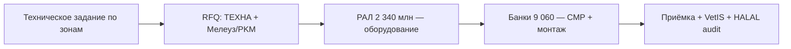

# Оборудование и вендоры — птицеводческий комплекс 12 млрд ₽

> **Статус:** техническое задание для закупки (draft). **Firm-контрактов нет.**  
> Аналог baseline кроликов: **Meneghin Srl** (содержание) + **SINT Technologies** (убой 2 400 гол/ч).

## Сводка по зонам

| Зона | CAPEX (из finmodel) | Производительность | Рекомендуемый стек | Альтернатива |
|------|---------------------|--------------------|--------------------|--------------|
| Птичники бройлера (80×) | часть 2 405 | 18 000 гол/дом | **TEXHA** (РФ) | Big Herdsman (CN) |
| Клетки несушек (6×) | ↑ | 480 000 гол | **TEXHA / Tekno** | Big Herdsman (CN) |
| Индюк / утка / гусь / перепёл | 1 025 | см. T02 | TEXHA + модульные решения | CN modular |
| Инкубаторий | в 8 570 | **500 тыс. яиц/нед.** | **Petersime** (EU, сервис РФ) | Chick Master / RF-сборка |
| УПК бройлер | **2 600** | **6 000 гол/ч** (8 ч) | **Мелеуз + PKM-79** (РФ) | Luohe Longfeng (CN) |
| Линии индейка / утка | в УПК | 500 / 2 000 гол/день | Мелеуз (вторичные линии) | CN compact |
| Сортировка яйца | в 8 570 | **0,5 млн шт/день** | **Moba Omnia** | NongYI (CN) |
| Холод **4 000 т** | 800 | −18 / +2 °C | **ААБ / Khladotech** (РФ) | Bitzer-интеграторы |
| Solar **10 МВт·ч** | **1 180,8** | — | **ASTORIOS HOLDING INC** | канon |
| Compost **5 т/ч** | **36** | 43 800 т/год | **Eco-Technics / Borey** (РФ) | — |
| Переработка пера/крови | в УПК | — | **Amandus Kahl** или **Волжский завод** | — |

---

## 1. Птичники и микроклимат (≈2 405 млн ₽ направление бройлер+яйцо)

### TEXHA (Россия) — **основной кандидат**

- Полный цикл: каркас, туннельная вентиляция, кормление, поение, автоматика, SCADA-интеграция.
- **80 бройлерных** по 2 000 м², 18 000 гол — стандартный профиль TEXHA «АviMax» / аналоги.
- **Плюсы:** РАЛ/российское сопровождение, сервис в РФ, референсы (Русагro, региональные ТК).
- **Минусы:** CAPEX выше китайского на **10–15%**; срок поставки **8–12 мес.** при полной загрузке.

### Big Herdsman / Chinagate (Китай) — **альтернатива**

- Дружественная юрисдикция; массовые поставки в РФ после 2022.
- **Плюсы:** цена, скорость.
- **Минусы:** сервис и ЗИП; проектирование под российские нормы СЗЗ/вет — на EPC-подрядчике.

**Рекомендация:** **TEXHA** на бройлер + несушки (РАЛ **2 340 млн** закрывает оборудование); клеточное и модульное — единый вендор для совместимости SCADA.

---

## 2. Инкубаторий (500 тыс. яиц/нед.)

| Вендор | Страна | Комментарий |
|--------|--------|-------------|
| **Petersime** | BE (сервис РФ) | Золотой стандарт; шкафы BioStreamer, выводные X-Stream; **≈6–8 шкафов** под 500k/нед. |
| **Pas Reform** | NL | Аналог Petersime; проверить канал поставки в РФ на дату закупки |
| **Chick Master** | US/CN prod | Дешевле; часто в новых ТК Сибири/Юга |

**Рекомендация:** **Petersime** — если доступен дилер Eurasia; иначе **Chick Master** с российской шеф-монтажной.  
**Срок:** заказ **за 12 мес.** до первой закладки.

---

## 3. УПК — ключевой объект (**2 600 млн ₽**)

### Производительность (из технологического цикла)

| Линия | Проектная мощность | Средняя нагрузка (365 дн.) |
|-------|-------------------|----------------------------|
| **Бройлер** | **6 000 гол/ч** × 8 ч = **48 000/день** | **≈24 900/день** (≈52% загрузки) |
| Индейка | 500 гол/день | 185/день |
| Утка/гусь | 2 000 гол/день | 75/день |
| Перепёл | партиями | — |

9,08 млн голов бройлера/год ÷ 365 ≈ **24 877 гол/день** — линия **6 000 гол/ч** даёт запас под пики и вторую смену.

### Мелеузский машиностроительный завод + PKM-79 (Россия) — **основной кандидат УПК**

- Комплексы убоя **3 600–12 000 бройлеров/ч** — типовой ряд для РФ.
- **Состав:** приёмка → оглушение → **халяль-рельс** (без оглушения, ручной рез) → шпарка → defeathering → evisceration → охлаждение (air/water) → разделка → упаковка → **Metal detector**.
- **Плюсы:** РАЛ, монтаж российскими бригадами, VetIS-совместимая трассировка, референсы **Cherkizovo, regional TK**.
- **Минусы:** автоматизация разделки ниже **Meyn (NL)**; FTE на разделке **≈60 операторов** (заложено в штате).

### Luohe Longfeng / Hebei Xiangfeng (Китай) — **альтернатива**

- Линии **4 000–8 000 bph**; поставки в СНГ/РФ.
- **Плюсы:** CAPEX **−20…30%** vs Мелеуз.
- **Минусы:** халяль-модуль и ветнадзор — отдельный проект; ЗИП.

### Meyn / BAADER / LINCO (EU) — **не базовый сценарий**

- Исторически стояли на лучших российских ТК; **новые контракты** — санкционные и логистические риски. Оставить как **upgrade path** при смене геополитики.

**Рекомендация:** **Мелеуз 6 000 гол/ч + халяль-блок + 2 compact-линии** (индейка/утка). EPC: **ПтицеКомплексМаш (PKM-79)** или **Техноком** (инжинiring).

---

## 4. Халяль-блок

| Элемент | Решение |
|---------|---------|
| Оборудование | Отдельный рельс, без электрооглушения; вакуумная камера опционально |
| Сертификация | **РДУМ** — внутренний халяль РФ |
| Связь с экспортом | **нет** — мясо птицы не экспортируется; экспорт APK — Tab#5 (`export-apk-baseline-tab5.md`) |

---

## 5. Яйцо — сортировка и упаковка

| Вендор | Модель | Комментарий |
|--------|--------|-------------|
| **Moba** | Omnia FT / PX | **0,5 млн шт/день** — 2–3 линии; лидер рынка |
| **NongYI** | CN analog | −30% CAPEX |

**Рекомендация:** **Moba** — если доступен сервис; иначе CN с российской наладкой.

---

## 6. Холодильник 4 000 т (800 млн ₽)

- **ААБ**, **Khladotech**, **Reftrans** — камеры, аммиачные холодильные центrals.
- **2 режима:** −18 °C (**≈3 000 т**), +2 °C (**≈1 000 т** яйцо/охлаждёнка).
- Энергия: приоритет **ночной тариф + solar 10 МВт·ч**.

---

## 7. Solar и compost (канon = кролики)

| | |
|--|--|
| Solar | **ASTORIOS HOLDING INC**, 10 МВт·ч, **1 180,8 млн ₽** |
| Compost | **5 т/ч**, **36 млн ₽**, помёт → 43 800 т удобрения |

---

## 8. Сравнение с baseline кроликов

| | Кролики | Птица (рекомендация) |
|--|---------|----------------------|
| Содержание | **Meneghin Srl** (IT), 69 intensive | **TEXHA** (RF), 118 модулей |
| Убой | **SINT** 2 400 гол/ч | **Мелеуз** 6 000 гол/ч бройлер |
| Корм | **FRAGOLA** (IT), в CAPEX | **ККЗ холдинга**, вне блока |
| Tier | Premium EU niche | **Масштаб RF industry standard** |

У кроликов — итальянский premium-niche; у птицы **12 млрд** — **российско-дружественный стек** (РФ + CN + ASTORIOS), реалистичный для РАЛ/ФНБ и санкционной среды.

---

## 9. Закупочная стратегия

| Этап | Срок | Действие |
|------|------|----------|
| T0 | −18 мес. | ТЗ, RFQ TEXHA + Мелеуз |
| T1 | −12 мес. | Контракт РАЛ (оборудование) |
| T2 | −9 мес. | Заказ Petersime / Moba |
| T3 | −6 мес. | Старт СМР птичников |
| T4 | 0 | Пуск-наладка УПК, VetIS |

**Риски:** сроки CN-поставок, одноканальность ЗИП, зависимость от **1 EPC** — заложить **≈150 млн резерв** (уже в CAPEX).

---

## 10. Что нужно от Жени для firm vendor

1. Выбор **TEXHA vs CN** по CAPEX/сроку.  
2. Подтверждение **Мелеуз vs CN** на УПК.  
3. ~~Приоритет экспорта ОАЭ/Иран~~ — **не актуально** (мясо птицы — только РФ).
4. Контакт **РАЛ** — предварительный каталог под 2 340 млн.
